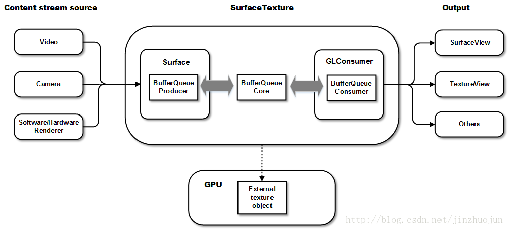

SurfaceView 从Android 1.0开始，带有surface。

在server端（WMS和SF）中，与主窗口分离，对surface的渲染可以放在单独线程去做，不会影响主线程对事件的相应，因surface不在view hierarchy中，显示不受view的属相控制，不能平移、缩放等

GLSurfaceView从Android1.5开始，作为surfaceView的补充。在SurfaceView基础上添加EGL的管理，自带渲染线程，用户需要实现Render接口。

SurfaceTexture从Android3.0开始，和Surface View不同是，对图像的处理并不像是，转GL外部纹理，可用于对图像进行数据流的二次处理。

