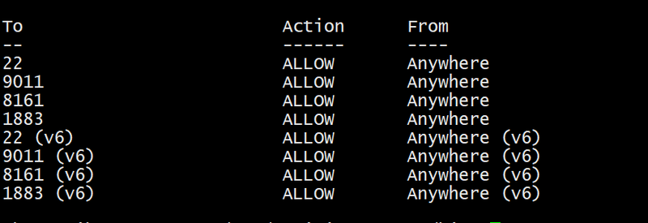
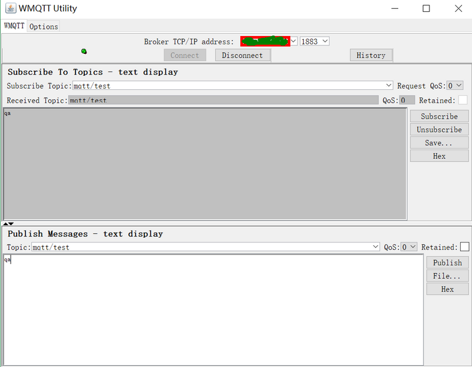
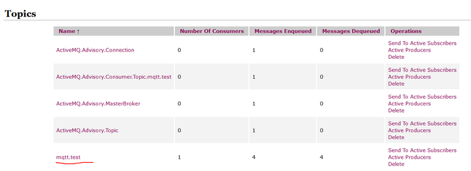

## 环境

ubuntu 16.04 

### 安装jdk

sudo apt-get install openjdk-8-jdk
    
## 配置activemq

### 下载安装

wget http://mirrors.hust.edu.cn/apache//activemq/5.15.2/apache-activemq-5.15.2-bin.tar.gz
    
解压到opt目录
sudo tar -xvf apache-activemq-5.15.2-bin.tar.gz /opt/activemq-5.15.2
    
防火墙开放端口
sudo ufw allow 8161 //web控制台
sudo ufw allow 1883 //mqtt使用端口
sudo ufw status 查看端口是否开放成功

  
启动mqtt
cd /opt/activimq-5.15.2/bin
./activemq start
    
登陆ip:8161 登陆查看web控制台
    
### 使用工具验证

验证工具有很多，chrome也有插件。这里使用java程序验证。
    

    
登陆web查看
    

已经可以查看到设置的主题。
    
[工具地址](https://pan.baidu.com/s/1jH4whWq)
密码: 7mgx

