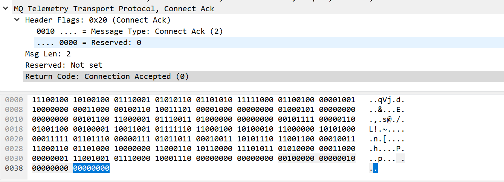
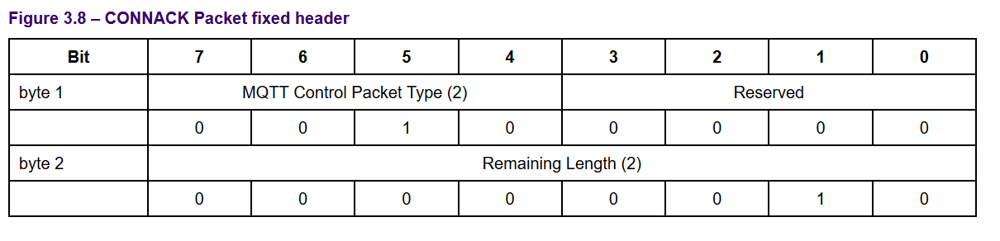
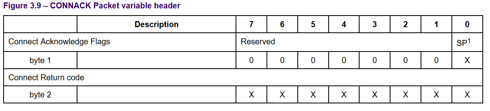
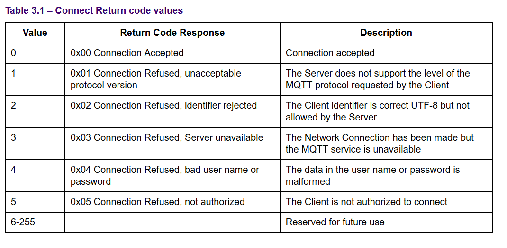

# 连接确认请求

服务器发送CONNACK用于回应客户端连接。服务器发送的第一个报文必须是CONNACK。

## 报文解析



```
00100000 00000010 00000000 00000000
```

### 固定报头


> 00100000 00000010

前四位0010为2，对应控制报文类型是 CONNACK;

剩余长度 00000010对应值为2，标识后面还有字节。

### 可变报头


> 00000000 00000000

**连接确认标志**
连接确认标志为0

**连接返回码**
放服务器无法处理连接时，放回一个非零的连接返回码。类似http返回码。


> 连接返回没有有效载荷。