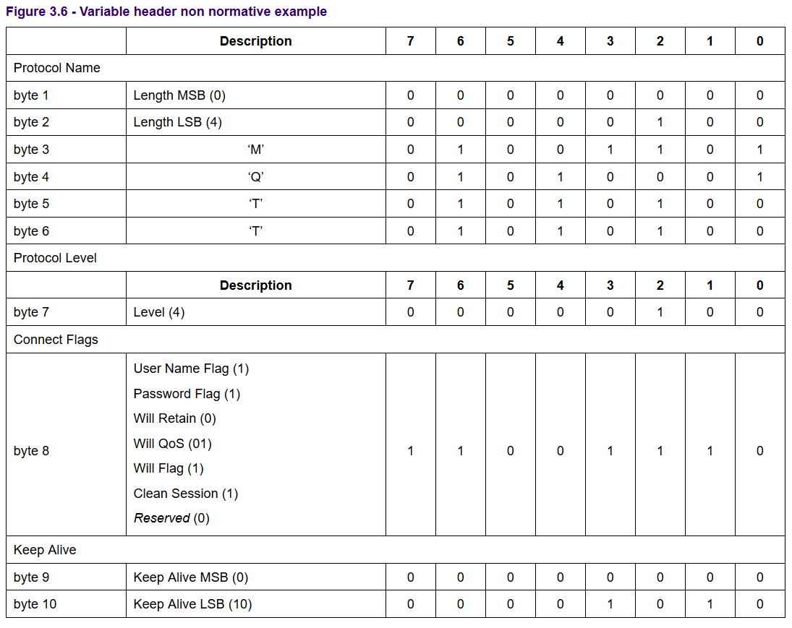

# 报文

控制报文可分为三个部分：固定报文、可变报文、有效报文

- 固定报文
    描述报文类型，报文等级等
- 可变报头
    不一定存在
- 有效载荷
    报文内容，信息存储的地方，还可以存放额外信息如ID等

# 报文实例解析


原始数据
```
00010000 00101101 

00000000 00000110 01001101 01010001 01001001 01110011 
01100100 01110000 
00000011 
00001110 
00000000 00011110 

00000000 00001100 01001101 01010001 01010100 01010100 01011111 01010101 01110100 01101001 01101100 01101001 01110100 01111001 00000000 00001001 01101101 01110001 01110100 01110100 00101111 01110111 01101001 01101100 01101100 00000000 00000110 01101101 01111001 01110111 01101001 01101100 01101100
```
## 固定报文

固定报文2个字节，mqtt报文类型，保留位和剩余长度
> 00010000 00101101

0001为1，是CONNECT控制字段，
0000为保留位
00101101为剩余长度，值为45.(剩余长度使用变长编码方案)

## 可变报头

可变报头包含四个字段：
- 协议名
- 协议级别
- 连接标志
- 保持连接

### 协议名字段

包含协议名称长度(2个字节)和协议名称，
> 00000000 00000110 01001101 01010001 01001001 01110011 01100100 01110000

00000000 00000110：长度 6

01001101 01010001 01001001 01110011 01100100 01110000：协议名称MQIsdp

### 协议级别字段

占一个字节
> 00000011：值为3，表示v3.1协议

### 连接标识字段

一个字节

> 00001110


保留位必须为0；

**清理会话 Clean Session**

控制会话状态的生存时间。

设置为0时：会话断开时，服务器会保留mqtt会话状体；

设置为1时，客户端断开后不在保留mqtt会话。

**遗嘱标志 Will Flag**
功能：通知其他的客户端某个客户端意外断开。

每个客户端都可以在连接broker时使用新的遗嘱(包含主题、保留标志、Qos的普通MQTT消息)。Broker将会存储遗嘱直到发现客户端意外断开；如果客户端意外断开，broker将会给所有此主题订阅者发送最新的遗嘱消息。遗嘱消息会在客户端发送DISCONNECT消息正常断开后被丢弃。

> 遗嘱帮助实现客户端掉线时处理策略，可以将掉线状态通知其他客户端。

当设置为1时；服务器会使用连接标志中Will Qos和Will Retain字段，以及有效载荷中包含Will Topic和Will Message字段。

当设置为0时，连接标识中Will Qos和Will Retain字段必须设置为0，以及有效不能包含Will Topic和Will message字段。

**遗嘱Qos Will Qos**
遗嘱消息的服务质量等级。

**遗嘱保留 Will Retain**
遗嘱消息发送后是否需要保留。

**用户名标志 User Name Flag**
设置为0，有效载荷中不能包含用户名字段
设置为1，有效载荷中必须中包含用户名字段

**密码标志 Password Flag**
设置为0，有效报文不能包含密码字段
设置为1，有效报文中必须包含密码字段

如果用户标识设置为0，密码标志必须设置为0

### 保持连接 Keep Alive

2个字节
> 00000000 00011110
心跳时间间隔,30s

可变报头示例



## 有效载荷 Payload
CONNECT报文有效载荷包含一个或多个以长度为前缀的字段。

可变报头决定有效载荷的字段内容。

如果存在，字段按照一下顺序出现：客户端标识符、遗嘱主题、遗嘱消息、用户名、密码。

```
00000000 00001100 
01001101 01010001 01010100 01010100 01011111 01010101 01110100 01101001 01101100 01101001 01110100 01111001

00000000 00001001 
01101101 01110001 01110100 01110100 00101111 01110111 01101001 01101100 01101100 

00000000 00000110
01101101 01111001 01110111 01101001 01101100 01101100
```

根据可变报头，有效载荷内容为
- 客户端长度 12，值为MQTT_Utility
- 遗嘱主题长度9，主题为mqtt/will
- 遗嘱消息长度6，消息为mywill


## 参考
- [MQTT Part 9 遗嘱](https://www.jianshu.com/p/816b1475bed6)
- [3.1 CONNECT – 连接服务端](https://github.com/mcxiaoke/mqtt/blob/master/mqtt/0301-CONNECT.md)
