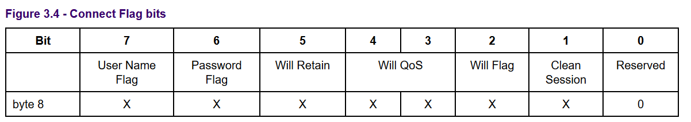

# 报文

控制报文可分为三个部分：固定报文、可变报文、有效报文

- 固定报文
    描述报文类型，报文等级等
- 可变报头
    不一定存在
- 有效载荷
    报文内容，信息存储的地方，还可以存放额外信息如ID等

# 报文实例解析


原始数据
```
00010000 00101101 
00000000 00000110 01001101 01010001 01001001 01110011 01100100 01110000 
00000011 
00001110 
00000000 00011110 00000000 00001100 01001101 01010001 01010100 01010100 01011111 01010101 01110100 01101001 01101100 01101001 01110100 01111001 00000000 00001001 01101101 01110001 01110100 01110100 00101111 01110111 01101001 01101100 01101100 00000000 00000110 01101101 01111001 01110111 01101001 01101100 01101100
```
## 固定报文

固定报文2个字节，mqtt报文类型，保留位和剩余长度
> 00010000 00101101

0001为1，是CONNECT控制字段，
0000为保留位
00101101为剩余长度，值为45.(剩余长度使用变长编码方案)

## 可变报头

可变报头包含四个字段：协议名、协议级别、连接标志、保持连接

协议名字段包含协议名称长度(2个字节)和协议名称，
> 00000000 00000110 01001101 01010001 01001001 01110011 01100100 01110000

00000000 00000110：长度 6

01001101 01010001 01001001 01110011 01100100 01110000：协议名称MQIsdp

协议级别字段占一个字节
00000011：值为3，表示v3.1协议

连接标识字段一个字节
000011100000111

